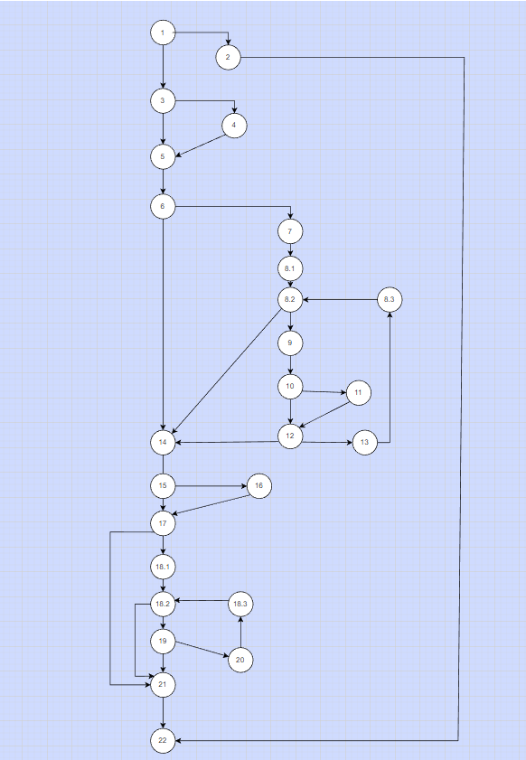
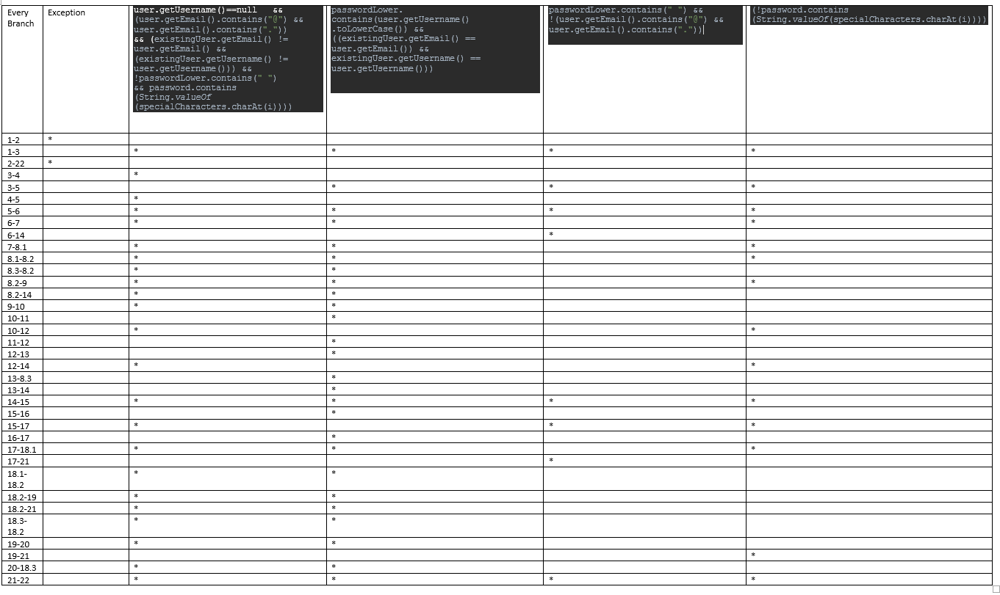

  # Втора лабораториска вежба по Софтверско инженерство
  Калина Спасева, бр. на индекс 213043

# Control Flow Graph

# Цикломатска комплексност
Цикломатската комплексност на дадениот код е 11. Ја пресметав така што го избројав бројот на региони во графот, а за да 
го потврдам решението го пресметав и според формулата E-N+2 = 35-26+2 = 11

# Tест случаи според Every Branch критериумот

# Тест случаи според Multiple Condition критериумот
Можни тест случаеви се:
T X X --> Ако user==null, другите два услови не се проверуваат
F T X --> Ако user!=null, user.getPassword()==null, третиот услов не се проверува
F F T --> Ако user!=null, user.getPassword()!=null, user.getEmail()==null (Третиот услов се исполнува)
F F F --> Ако user!=null, user.getPassword()!=null, user.getEmail()!=null (Условот не е исполнет)

